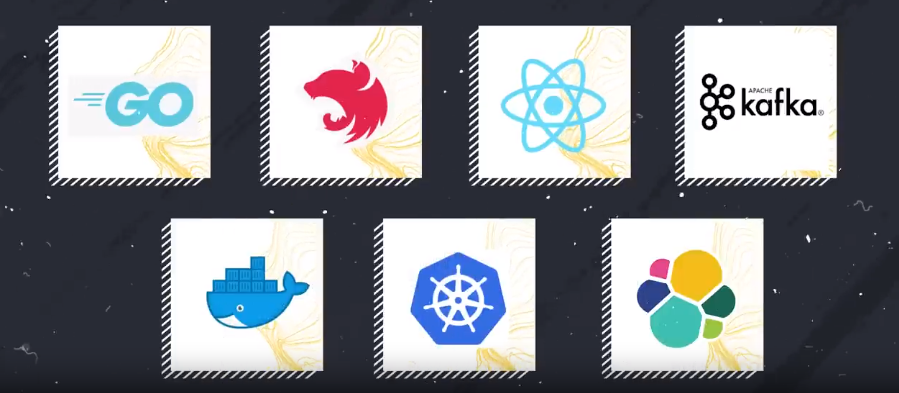
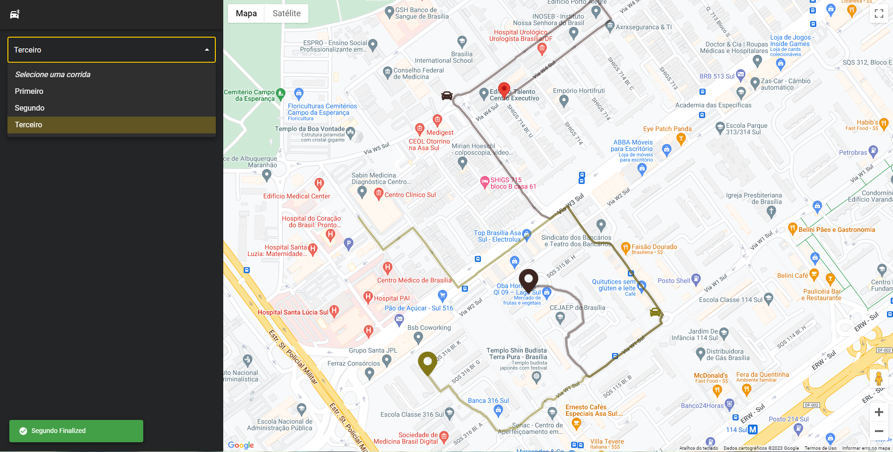
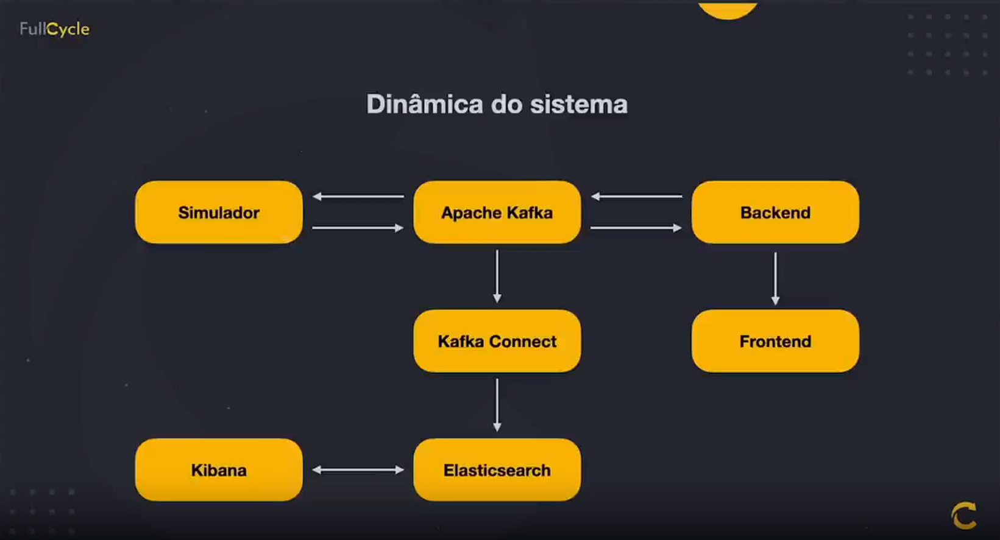
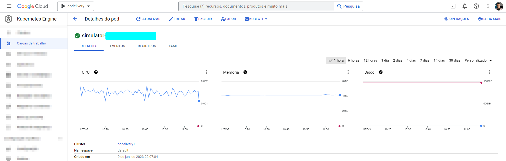

# Travel Simulator

<p align="center"> 
  <a href="https://fullcycle.com.br/" target="_blank">
    
  </a> 
</p>

<h4 align="center" >🚀 🟨 Full Cycle Event - 2023 🟨 🚀</h4>

<h4 align="center">
  Application developed during a Programmer Event, the <a style="color: #8a4af3;" href="https://github.com/search?q=imers%C3%A3o%20full%20cycle&type=repositories" target="_blank">Full Cycle Immersion</a> promoted by <a style="color: #8a4af3;" href="https://fullcycle.com.br/" target="_blank">@FullCycleSchool</a>
</h4>

#

<p align="center">
  |&nbsp;&nbsp;
  <a style="color: #8a4af3;" href="#project">Overview</a>&nbsp;&nbsp;&nbsp;|&nbsp;&nbsp;&nbsp;
  <a style="color: #8a4af3;" href="#techs">Technologies</a>&nbsp;&nbsp;&nbsp;|&nbsp;&nbsp;&nbsp;
  <a style="color: #8a4af3;" href="#app">Project</a>&nbsp;&nbsp;&nbsp;|&nbsp;&nbsp;
  <a style="color: #8a4af3;" href="#run-project">Run</a>&nbsp;&nbsp;&nbsp;|&nbsp;&nbsp;
  <a style="color: #8a4af3;" href="#author">Author</a>&nbsp;&nbsp;&nbsp;|&nbsp;&nbsp;&nbsp;
</p>

#

<h1 align="center">
  
  <a href="https://github.com/Samuel-Ricardo">
    
  </a>

  <a herf="https://www.instagram.com/samuel_ricardo.ex/">
     
  </a>

  <a herf='https://www.linkedin.com/in/samuel-ricardo/'>
     
  </a>

</h1>

<br>

<p id="project"/>

<h2>  | :artificial_satellite: About:  </h2>

<p align="justify">
  This project is a application of a complete Full Cycle project, with amazing technologies like NextJS for front-end, NestJS for back-end, PostgreSQL database, GO Lang for microsservice, Docker & Kubernetes for devops, metrics with Elastic Search & Kibana, Message / Event Driven Architeture with Kafka and more.
</p>



<p align="justify">
  The propurse of this microsservice is only one, simulate and provide travels routes for all applications of this project, for this comunication between apps, i use Kafka that is a amazing solution to handle data traffic using events, super scaleble, garant the safety of every byte of data whithout data loses.
</p>

<p align="justify">
  The Kubernetes manages this applications on Google Cloud Platform, with a amazing peformance and scalability. Kubernetes is a container orchestrator thats ensures resilience to your application using the most advanced strategies for handle your applications
</p>

<p align="justify">
   All goes as data stream having Kafka as intermediator thats ensures no loses keeping the original order of the message even though something crash, when it back to work will run as if nothing has happen, it all is sended to back-end that processes them and send to front-end. All data have backup in Elastic Search thats in addition to besides being a Powerfull Search Engine, it is also a full ecosystem that includes Kibana a full Data Analytics that allow you to use data provideded by Elastic to build powerfull graphics and Analytics
</p>

> <a href="https://samuel-ricardo.github.io/">  </a>

  <br>
  
- This Microsservice is hosted on Google Cloud Platform - [GCP] 
- Current Version: <b> 1.0.0 </b>

#

<br>

<h2 id="techs">
  :building_construction: | Technologies and Concepts Studied:
</h2>

> <a href='https://go.dev/'>  </a>

- Go Lang
- Kafka
- Kubernetes
- Docker
- Elastic Search
- Kibana
- Data Analytics
- Perfomance
- Event Driven Architeture
- Scalability
- Real Time

> Among Others...

<br>

#

<h2 id="app">
  💻 | Application:
</h2>




#

<h2 id="run-project"> 
   👨‍💻 | How to use
</h2>

<br>

### Open your Git Terminal and clone this repository

```git
  $ git clone "git@github.com:Samuel-Ricardo/travel_simulator.git"
```

### Make Pull

```git
  $ git pull "git@github.com:Samuel-Ricardo/travel_simulator.git"
```

<br>

This application use `Docker` so you dont need to install and cofigurate anything other than docker on your machine.

> <a target="_blank" href="https://www.docker.com/">  </a>

<br>

<p align="justify">

First you need to up Apache Kafka and Elastic Search environment, we will use docker for this. so let's to apache folder `$ cd ./.docker/apache_kafka/` and run it.

</p>

```bash

  # Once docker is configured:

  $ cd ./.docker/apache_kafka/
  $ docker-compose up


```

<p align="justify">

Once Apache Kafka, Confluent Dashboard, Zookeper, Elastic Search and Kibana are up, we can start the project :D (to go back for root project folder: `$ cd ../../`)

</p>

```bash

  # After setup docker environment just run this commmand on root project folder:

  $ docker-compose up --build   # For First Time run this command

  $ docker-compose up           # to run project


```

```bash

  #Apps Running on:

  $ Elastic Search: http://localhost:9200

  $ Kibana: http://localhost:5601

  $ [Kafka] Confluent Dashboard: http://localhost:9021

  See more: ./.docker/apache_kafka/docker-compose.yaml

```

#

<br>
<br>

#

<h2 id="author">
  :octocat: | Author:  
</h2>

> <a target="_blank" href="https://www.linkedin.com/in/samuel-ricardo/">  <br> <p> <b> - Samuel Ricardo</b> </p></a>

<h1>
  <a herf='https://github.com/Samuel-Ricardo'>
     
  </a>
  
  <a herf='https://www.instagram.com/samuel_ricardo.ex/'>
     
  </a>
  
  <a herf='https://twitter.com/SamuelR84144340'>
     
  </a>
  
   <a herf='https://www.linkedin.com/in/samuel-ricardo/'>
     
  </a>
</h1>
